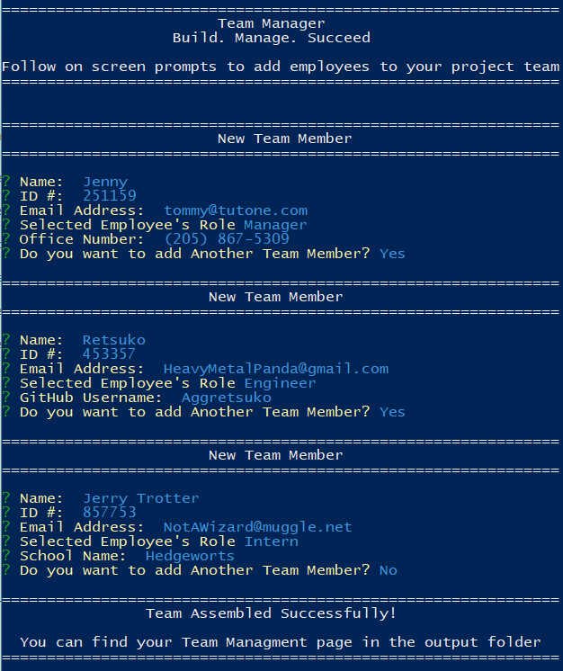
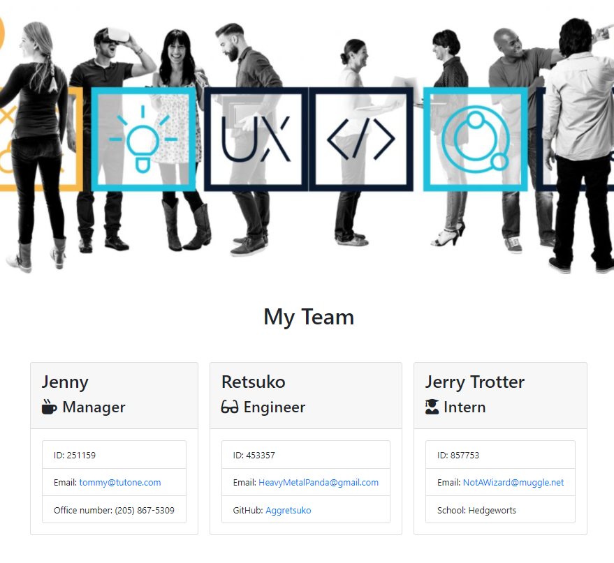

# Team Manager

  

## Description

A command line application that generates an HTML file to assist in organizing employees assigned to a project

## Table of Contents

* [Installation](#installation)
* [Usage](#usage)
* [Contributing](#contributing)
* [Tests](#tests)
* [Support](#support)
* [License](#license)

## Installation

*Requires Node.js to run*

Download and save the Team-Manager folder in your favorite directory.

Using your preferred console, navigate to the program's root folder (./Team-Manager/). From here you will need to install the dependent files not included with this program. Do this by running the command ```npm install``` and you will be notified once it is finished.

## Usage

From the program's root folder (./Team-Manger/), execute the app.js file using node ``node .\app.js`` to run the program. Follow the in console prompts to fill in the required fields for each employee to be added to the team. . [This Video](https://drive.google.com/file/d/1OpptWnEgoJRVjxxjW4vBcLpegtwtsgkG/view) demonstrates the use of the program through powershell.





The generated file is saved in (./Team-Manager/output/team.html) and is overwritten each time the program is run.

## Contributing

No contributions are currently being accepted for this project.

## Support

For support regarding this project please contact me via GitHub

## License

This project is licensed under the MIT License.